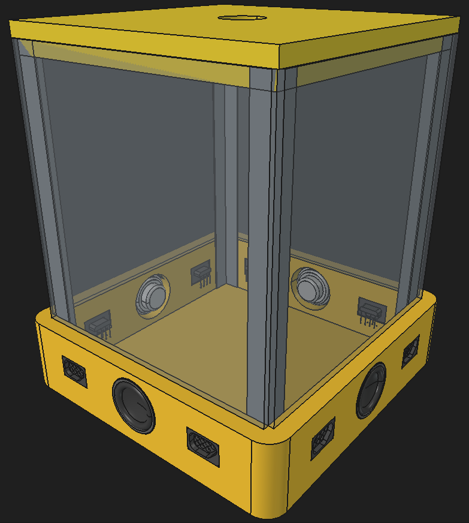

# Propuesta de diagrama general de flujo. (Funciones)

# Modelo 3d.

# Adaptador PS2 a Nes protocol.
Teniendo en cuenta los dos protocolos y buscando la generalización y facilidad del usuario a la hora de elegir sus controles dentro de la consola. La idea de plantear un estilo de conversor nace, esta idea toma en cuenta ambos protocolos y establece una solución viable para la conexión de dispositivos con PS2 o controles de la NES.

Teniendo en cuenta que los controles de la NES, usan 5 conexiones útiles, de los cuales dos son para alimentación y ground y los demás para la transferencia de información: 

Por otra parte, el protocolo PS2 hace uso únicamente de dos cables de transferencia de datos. Esta distinción entre los dos, genera una manera rápido de interpretar que tipo de conector está dentro de la entrada al conectar una resistencia ya sea a ground o a vcc al adaptador del pin restante.

Con este objetivo se plantea el siguiente diagrama simplificado de conexiones del adaptador el cual podría estar sujeto a cambios:
